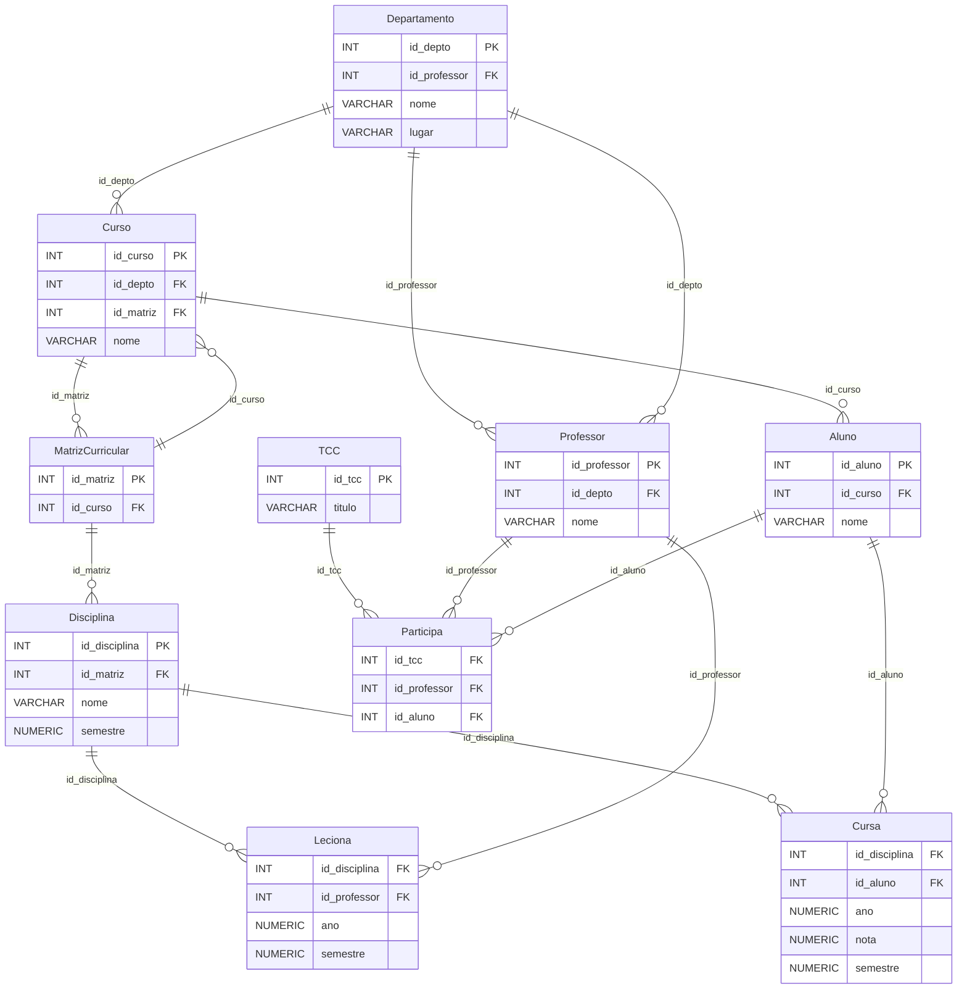

# Sistema de Gestão de Faculdade - Ciência da Computação FEI

Este repositório contém o projeto final da disciplina de Banco de Dados do curso de Ciência da Computação no Centro Universitário FEI. O objetivo do projeto é desenvolver um sistema para gerenciar uma faculdade, abrangendo desde a estrutura dos departamentos e cursos até a alocação de alunos e professores.

## Descrição do Projeto

O sistema de gestão de faculdade abrange as seguintes funcionalidades e estruturas:

- **Departamentos:** A faculdade possui 8 departamentos.
- **Cursos:** Cada departamento oferece 1 curso, totalizando 8 cursos.
- **Matriz Curricular:** Cada curso possui 1 matriz curricular composta por 6 disciplinas.
- **Alunos:** Cada curso possui 5 alunos.
- **Professores:** Cada departamento possui 3 professores, sendo um deles o chefe do departamento. Cada professor leciona 2 disciplinas do curso.
- **Trabalho de Conclusão de Curso (TCC):** Existem 4 grupos de TCC, cada um composto por 5 alunos e orientado por 1 professor.

## Tecnologias Utilizadas

- **SGBD:** CockroachDB
- **Linguagem de Programação:** Python
- **Linguagem de Consulta:** SQL

## Instruções

1. Clone este repositório:
    ```bash
    git clone https://github.com/enzzopp/projeto-banco-de-dados.git
2. Navegue até o diretório do projeto:
    ```bash
    cd projeto-banco-de-dados
    ```
3. Execute os seguintes arquivos SQL para criar e popular o banco de dados no Cockroach:
    ```bash
    createSchema.sql
    dataInsertion.sql
    ```
4. Execute as queries a partir do arquivo SQL::
    ```bash
    queries.sql
    ```
5. Execute os scripts Python para gerar dados de teste (OPCIONAL):
    ```bash
    python dataGenerator.py
    ```
## Diagrama de Relacionamento

Este é o diagrama de relacionamento das tabelas do banco de dados usando Mermaid.



## Contribuidores

- [Enzo Pacheco Porfirio - 24.122.003-7](https://github.com/enzzopp)
- [Gabriel Destro - 24.122.059-9](https://github.com/httpDerpyy)
